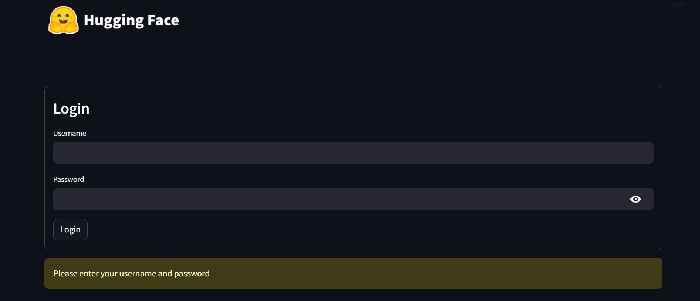
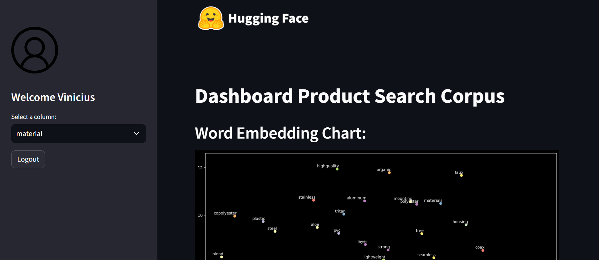

## Machine Learning Data App
A data app that uses Open AI API to classify product-search-corpus dataset, also apply a Word2Vec model on classified data and plot a t-SNE representations of the most common classifications.

## 🔒 Authentication
To login in this app, use the following credentials:
- User: vinicius
- Password: senha123

## 🪟 App visualization
In this example, we plotted a t-SNE representations of the most common words using the column *materials*.

